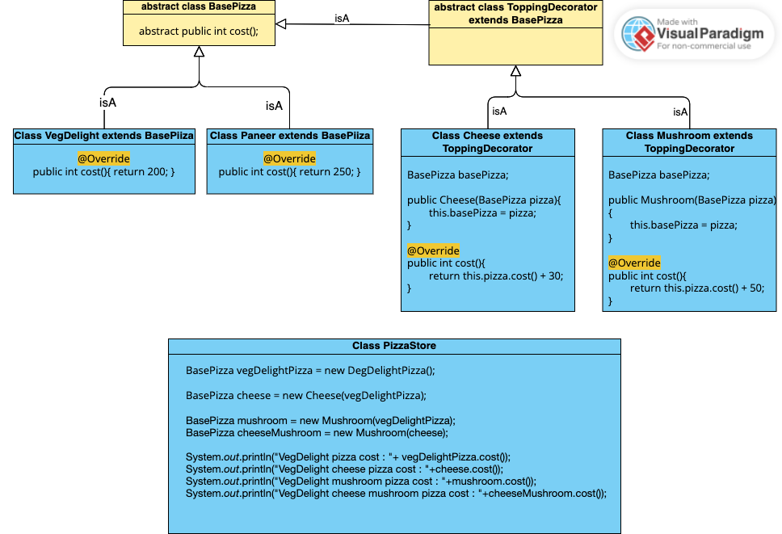

# Decorator design pattern
### Decorator is a structural pattern
- It allows adding new behaviors to objects dynamically by placing them inside special wrapper objects, called decorators.
- Decorator patterns allow a user to add new functionality to an existing object without altering its structure.

