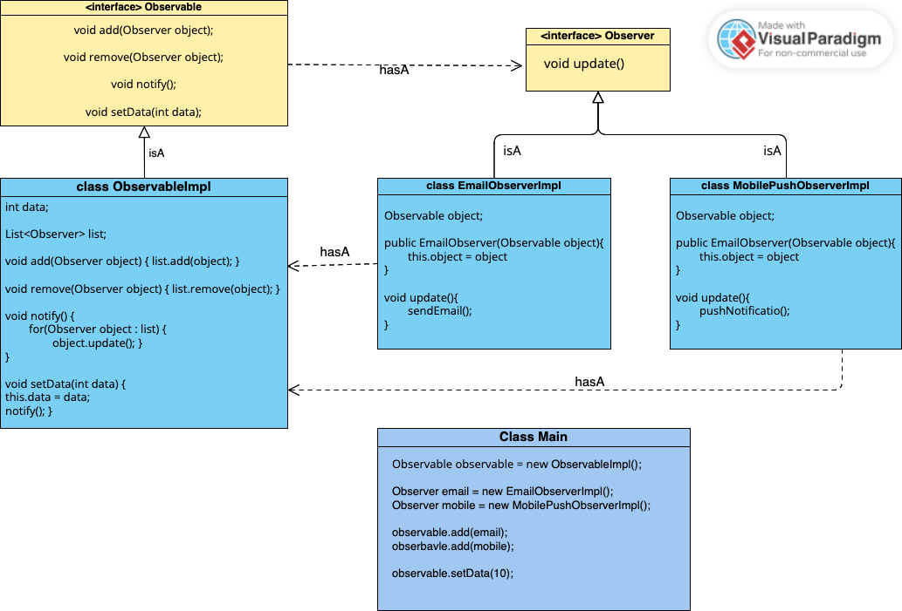

# Observer Design Pattern
### It is behavior design Pattern
- Observer design pattern is useful when you are interested in the state of an object and want to get notified whenever there is any change.
- Object that is being watched is called Observable/Subject.
- The one who watched on object is called Observer.

